# Data Scientist Nanodegree

## Spark for Big Data

## Project: Analyzing Customer Churn with Spark

## Table of Contents

- [Definition](#def)
  - [Project Overview](#overview)
  - [Problem Statement](#problem)
  - [Metrics](#metrics)
- [Analysis](#analysis)
  - [Data Exploration](#explore)
  - [Data Visualisation](#data_viz)
- [Methodology](#method)
  - [Data Preprocessing](#data_prep)
  - [Implementation](#implement)
  - [Refinement](#refine)
- [Conclusion](#conclusion)
  - [Reflection](#reflect)
  - [Challenges](#challenges)
- [References](#refs)
- [Acknowledgement](#ack)

***

## I. Definition

### Project Overview

You might have heard of the two music streaming giants: **Apple Music** and **Spotify.**
Which is better than the other? Well, that depends on multiple factors, like the
UI/UX of their app, the frequency of new content, user-curated playlists and
subscribers count. The factor which we are studying is called the churn rate. Churn rate has
a direct impact on the subscribers' count and also the long term growth of the business.

**So what is this churn rate anyway?**

>For a business, the churn rate is a measure of the number of customers leaving
the service or downgrading their subscription plan within a given period of time.

### Problem Statement

Imagine you are working on the data team for a popular digital music service
similar to **Spotify** or **Pandora. Millions** of users stream their favourite
songs to your service every day either using the **free tier** that plays
advertisements between the songs or using the **premium** subscription model
where they stream music at free but pay a monthly flat rate. Users can
**upgrade, downgrade or cancel** their service at any time so it is crucial to
make sure your users love the service.

In this project, our aim is to identify the customer churn for Sparkify (a
Spotify-like fictional music streaming service). This does not include the variety
(like the genre, curated
playlists, top regional charts) of music that the
service provides. It mainly explores user behaviour and how we can identify
the possibility that a user will churn. Such customers are those who decide to downgrade their service, i.e. going from paid
subscription to free, or entirely leaving the service.

Our target variable is `isChurn`. It cannot be interpreted directly from the JSON
file, but we will use feature
engineering to create it. `isChurn` column is `1` for users who visited the
`Cancellation Confirmation` page and `0` otherwise.

### Metrics

Out of **225** unique users, **only 52** churned **(23.5%).** So, accuracy will not be a
good metric to handle this imbalance. We will instead use **F1-Score** to
evaluate our model.

F1-Score is the **harmonic mean** of **precision** and **recall.**

Precision = True Positive / (True Positive + False Positive)

Recall = True Positive / (True Positive + False Negative)

## II. Analysis

### Data Exploration

Name of the input data file is *mini_sparkify_event_data.json* in data
directory. The shape of our feature space is 286500 rows and 18 columns.
_data/metadata.xlsx_
contains information about the features.

A preview of data:

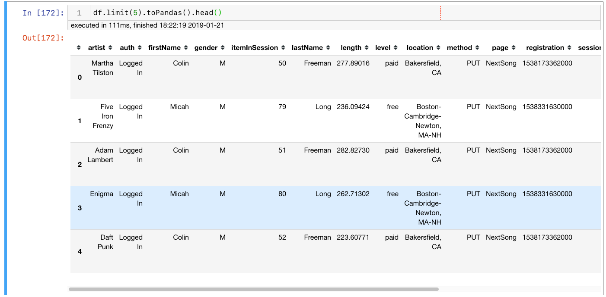

I have used `toPandas()` method above because 18 columns cannot be displayed in
a user-friendly way by PySpark's built-in `.show()` method. Still, if you like
to see what it looks like with `.show()` method, [here](https://github.com/sanjeevai/sparkify-capstone/blob/master/img/pyspark_show.png) you go (you will not like it).

#### Feature Space

##### Univariate Plots

1. Distribution of pages

    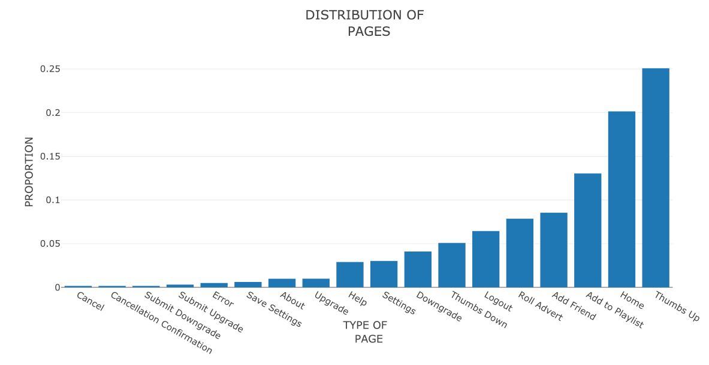

    Cancellations are less. That is what we have to predict.

    We will remove the starting classes: `Cancel` and `Cancellation Confirmation` in
    our modelling section to avoid lookahead bias.

    Most commonly browsed pages include activities like the addition to a playlist, home
    page, and thumbs up.

    I have not inclued `NextPage` category because it is present around [80%](https://github.com/sanjeevai/sparkify-capstone/blob/master/img/next_song_dist.png) of
    the time and will highly skew the distribution.

2. Distribution of levels (free or paid)

    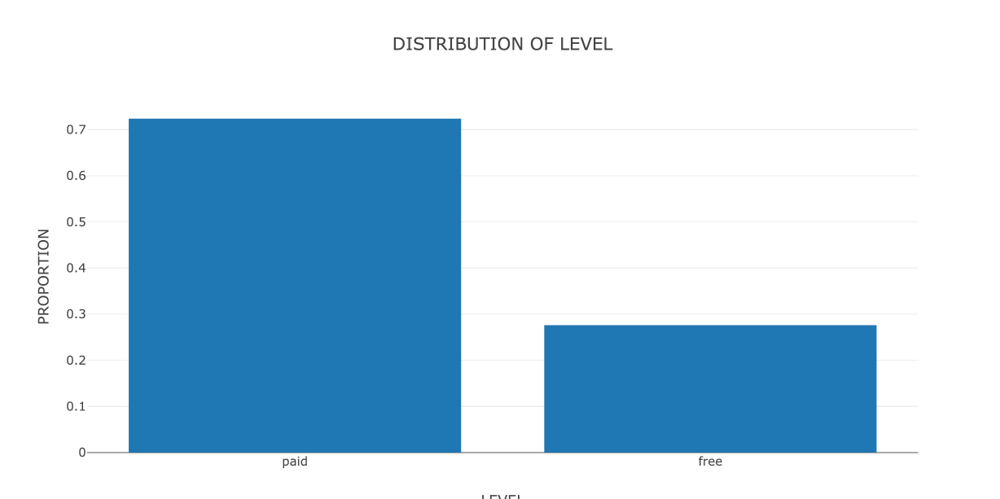

    70% of churned users are paying customers. Customer retention is relatively more important
    for paid ones because they are directly connected with the revenue of the company.

3. Song length

    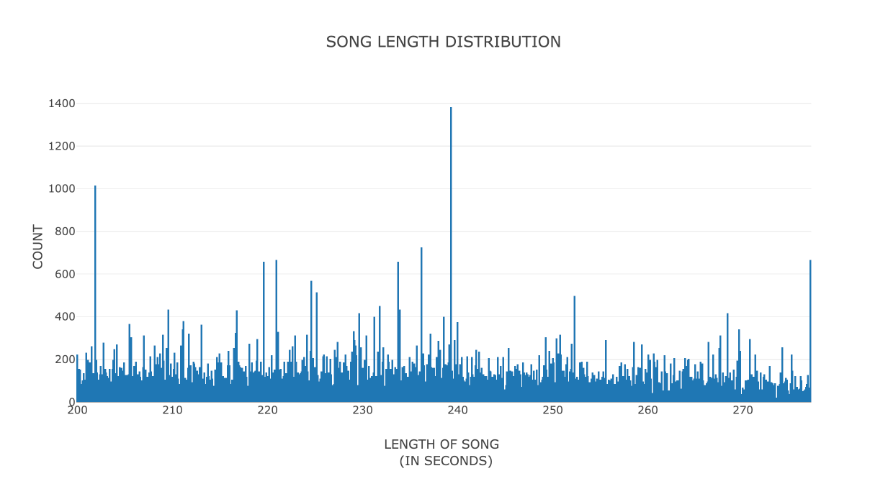

    No additional information is available from this. It just shows
    that most songs are **4 minutes** long.

4. What type of device user is streaming from?

    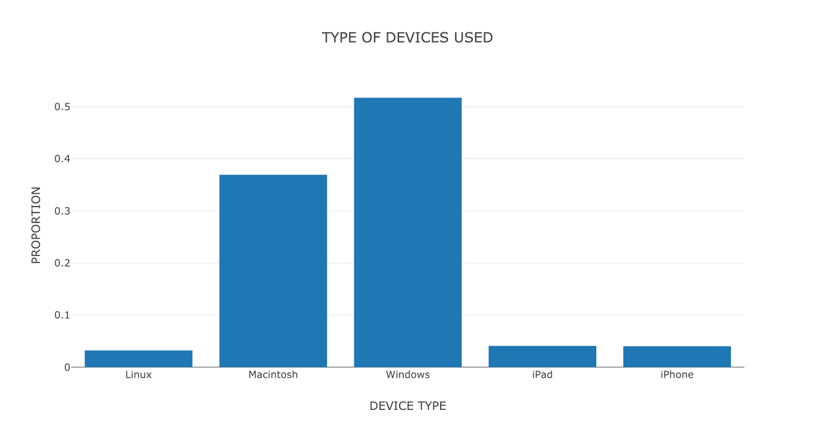

    This is what we have expected. Windows is the most used platform.

##### Multivariate Plots

1. Gender distribution

    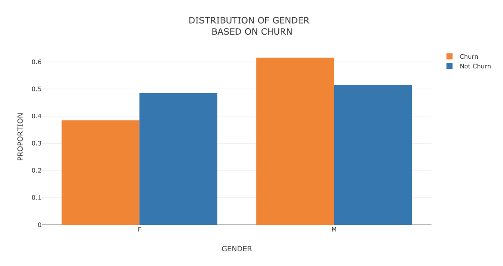

    Males are more in number.

2. Distribution of pages based on churn

    

    No strong conclusion can be drawn from this graph. It also shows the same common
    actions as seen from the univariate plot [here](#page_dist_uni)

3. Distribution of hour based on churn

    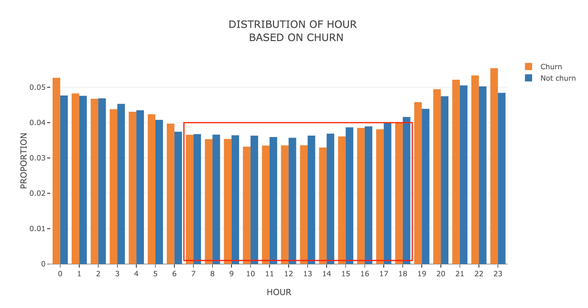
    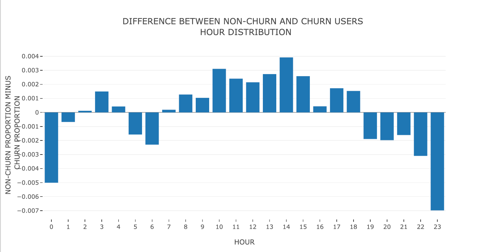

    We can see that non-churn users are more active during day time.

4. Behaviour across weekdays

    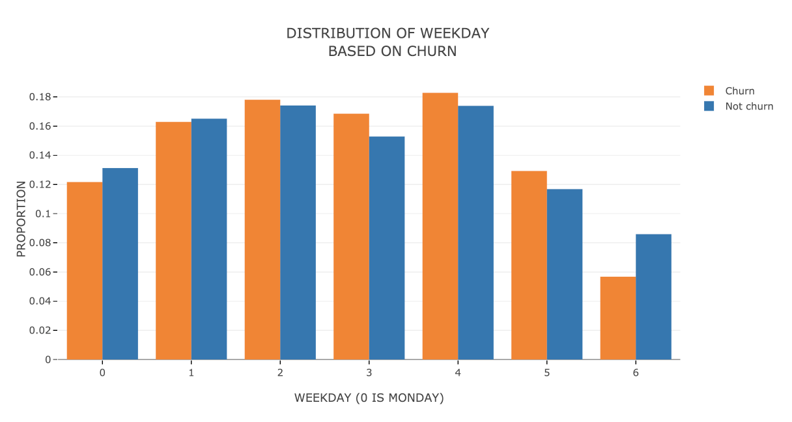
    

    Activity is more on weekdays. Especially for churned users. However, this change
    is not significant.

5. Behaviour at the month level

    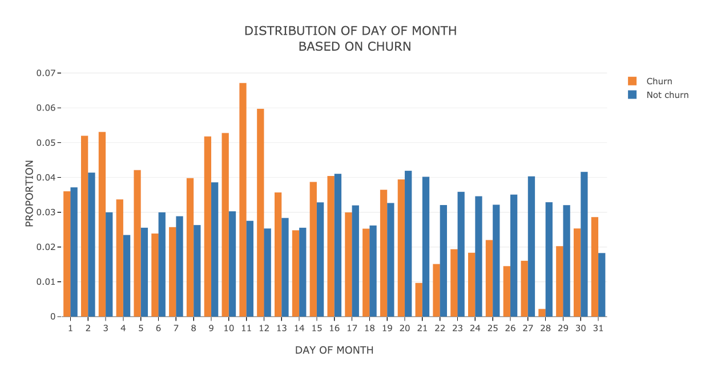

    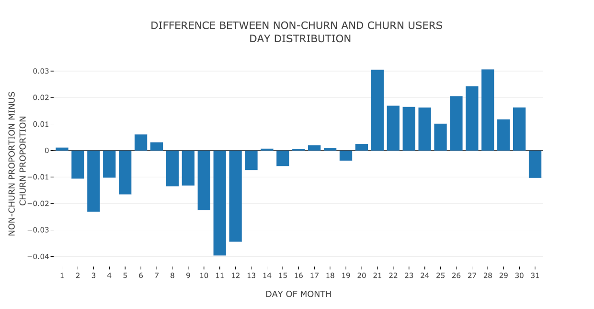

    Non-churn users are generally less active at the start of the month as compared
    to churn users, and the opposite is the case at the EOM.

#### Target Space

For `page` column, we have 22 distinct values:

1. About
2. Add Friend
3. Add to Playlist
4. Cancel
5. **Cancellation Confirmation**
6. Downgrade
7. Error
8. Help
9. Home
10. Login
11. Logout
12. NextSong
13. Register
14. Roll Advert
15. Save Settings
16. Settings
17. Submit Downgrade
18. Submit Registration
19. Submit Upgrade
20. Thumbs Down
21. Thumbs Up
22. Upgrade

We are interested in the fifth category. Our target variable is
`isChurn`. It is `1` if the user visited `Cancellation Confirmation` page and
`0` otherwise.

### Data Visualisation

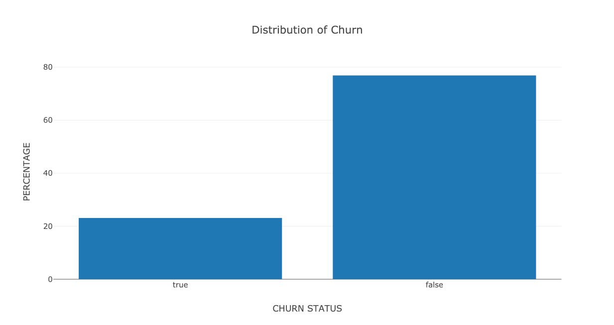

This imbalanced data suggests that we should not use accuracy as our evaluation
metric. We will use F1 score instead and use under-sampling to further optimise it.

## III. Methodology

### Data Preprocessing

1. Handling null values

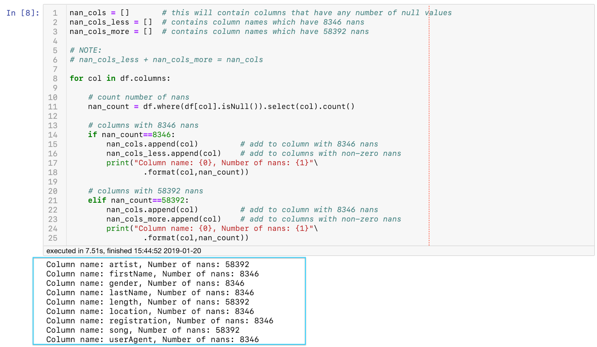

First, we will remove null values for some columns. There are two distinct number of
null values observed: **8346** and **58392.**

58392 is **20%** of the data (286500) and 8346 is merely **2%.** So we keep the columns which
have 2% `nan`s and see for the 20% one's whether we can impute the missing
values in some way.

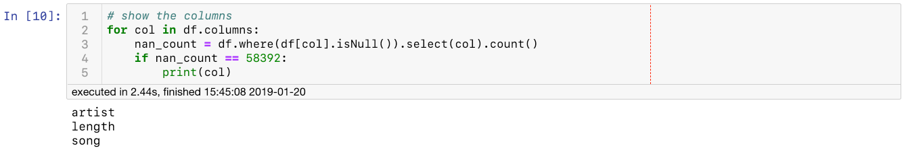

These are the columns with **20%** missing values. Seems like it is difficult to
impute them. We will drop the
respective rows with null values for these columns.

### Implementation

We have the same training and testing features for all the models. PySpark's ML
[library](https://spark.apache.org//docs/latest/api/python/pyspark.ml.html)(`pyspark.ml`) has access to the most common machine learning classification
algorithms. Others are still in development, like
[Tree Predictions in Gradient Boosting to Improve Prediction Accuracy](https://issues.apache.org/jira/browse/SPARK-4240).

The ones which we'll be using are:

- [Logistic Regression](#ref_lr)
- [Random Forest Classifier](#ref_rf)
- [Gradient Boosting Trees](#ref_gbt)

### Refinement

Since the class distribution is highly imbalanced, we will perform random
undersampling to optimize our **F1 score**.

F1 is the harmonic mean of precision and recall. Precision and recall are
calculated in the following way:

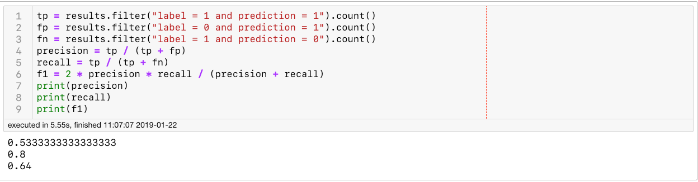

This [article](#f1_blog) will deepen your understanding on why to use F1 score when evaluating your model on imbalanced data set.

Comparison of average metrics before and after undersampling.

|Model|Average Metrics Before|Average Metrics After|
|-----|----------------------|---------------------|
|Logistic Regression|**0.717,** 0.684, 0.681|**0.486,** 0.344, 0.192|
|Random Forest Classifier|**0.710,** 0.699, 0.698|**0.540,** 0.537, 0.499|
|Gradient Boosting Tree Classifier|**0.710,** 0.705, 0.684|**0.629,** 0.627, 0.616|

> GBTClassifier provided a fairly good F1 score of 0.64 after undersampling.

## IV. Conclusion

### Reflection

I enjoyed the data pre-processing part of the project. For data visualisation part, instead of using “for” loops to get arrays for our bar chart, I first converted our Spark data frame to Pandas data frame using toPandas()method. Data visualisation is easier from then on.

The shape of our final data is just 225 x 32. This is too small to generalise our model. Just 225 users for a streaming company? That’s nothing. 12 GB data might provide some useful results. If you want more statistically significant results then I suggest you run this notebook on Amazon EMR for the 12 GB dataset. I have skipped that part for now because it costs $30 for one week.

### Challenges

Some of the challenges which I faced in this project are:

- Official documentation of PySpark as compared to Pandas
- For the sake of mastering Spark, we only used the most common machine learning
  classification models instead of using the advanced ones
- Highly imbalanced data led to a poor F1 score
- If you run this notebook on your local machine without any change, then it
  will take around an hour to run completely

## V. References

- [Getting Pandas like dummies in PySpark](https://stackoverflow.com/questions/42805663/e-num-get-dummies-in-pySpark)

- [Using multiple if-else conditions in a list comprehension](https://stackoverflow.com/questions/9987483/elif-in-list-comprehension-conditionals)

- [Business Insider article on classifying region based on U.S. State](https://www.businessinsider.in/The-US-government-clearly-defines-the-Northeast-Midwest-South-and-West-heres-where-your-state-falls/THE-MIDWEST/slideshow/63954185.cms)

- [Write single CSV file (instead of batching) using
  Spark](https://stackoverflow.com/questions/31674530/write-single-csv-file-using-spark-csv)
  

- [Python API docs for Logistic Regression](https://spark.apache.org/docs/2.1.1/api/python/pyspark.ml.html#pyspark.ml.classification.LogisticRegression)

- [Python API docs for Random Forest Classifier](https://spark.apache.org/docs/2.1.1/api/python/pyspark.ml.html#pyspark.ml.classification.RandomForestClassifier)

- [Python API docs for GBTClassifier](https://spark.apache.org/docs/2.2.0/api/python/pyspark.ml.html#pyspark.ml.classification.GBTClassifier)

- [Knowledge about F1 score and why it is a better metric for imbalanced data
  set](https://towardsdatascience.com/beyond-accuracy-precision-and-recall-3da06bea9f6c)

## VI. Acknowledgements

Thanks to **Udacity** for providing such a challenging project to work on. At first, I was vexed with functional programming in Python, but the instructors were very clear in their approach. Now I am looking for more projects that are build atop Spark.